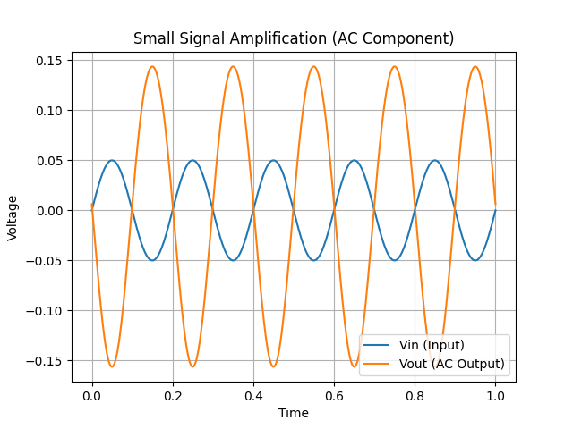

# MOSFET_Amplifier_Analysis
Analysis of voltage gain in a MOSFET common-source amplifier.

## Question
- MOSFET 공통 소스 증폭기는 어떤 조건에서 최대 성능을 가지는가?
- gm과 bias(Vgs)는 전압 이득과 선형성에 어떤 영향을 미치는가?

## Plan
- MOSFET Id–Vgs 특성으로부터 gm 계산
- 공통 소스 증폭기 모델 구성
- Vgs (bias)에 따른 gm 변화 분석
- gm에 따른 전압 이득 변화 분석
- 입력 신호 크기에 따른 출력 파형 변화 (distortion) 분석

## Result

## Observation
-입력신호는 사인파 형태를 보인다. 
-출력신호는 입력보다 더 큰 진폭을가지고    위상은 반대이다.

## Interpretation
- 공통 소스 증폭기 특성에 따라 출력은 입력과 비교해서 반전되며 증폭된다.

- 작은 신호 조건에서 MOSFET이 동작점 주변에서 선형적으로 동작해서 왜곡 없이 증폭된다.

## Conclusion
- Small Signal 조건에서 MOSFET 공통 소스 증폭기는 입력 신호를 선형적으로 증폭 시키고 출력은 입력에 비해 더 큰 진폭과 반전된 위상을 가진다. 이를 통해 증폭기가 정상적으로 동작함을 확인하였다. 

## Next Plan
- large sinal 영역에서의 비선형 왜곡 분석

## Result

## Observation

## Interpretation